# Advanced PD workshop on Openlane RTL2GDS flow

Reposotory documents the work done during the Advanced PD workshop using OpenLANE + SKY130 + PICORV32

## RTL2GDS
RTL to GDS flow refers to the process of systematically converting a Register Transfer Level (RTL) to a Graphic Design System (GDS)  II (2) stream format guided by a Synopsys® Design Constraints (SDC) for Timing requirements and a Process Design Kit for Physical Layout constraints.


| Step 	| RTL2GDSII FLOW         	|
|------	|------------------------	|
| 1    	| RTL Synthesis          	|
| 2    	| Floorplan              	|
| 3    	| Placement              	|
| 4    	| Static Timing Analysis 	|
| 5    	| Clock Tree Synthesis   	|
| 6    	| Routing                	|
| 7    	| GDSII Streaming        	|


## TOC

| Day 	| Topics covered                        	|                                          	|
|-----	|---------------------------------------	|------------------------------------------	|
| 1   	| Tool Flow                             	|                                          	|
|     	| Understanding the pdks Directory structure 	|                                          	|
|     	| RTL Synthesis                         	| Yosys+ABC                                	|
| 2   	| Floorplanning                         	| Utilization and Aspect Ratio             	|
|     	|                                       	| IO Placement                             	|
|     	|                                       	| Insertion of ENDCAP TAP cells            	|
|     	|                                       	| OpenLANE: Running floorplan              	|
|     	|                                       	| Viewing the Floorplan output using MAGIC 	|
|     	| Placement                             	| OpenLANE: Placement                      	|
|     	| Cell design and Characterisation Flow 	|                                          	|
| 3   	| Cell Design                           	| CMOS Inverter design and DRC using Magic 	|
|     	|                                       	| SPICE Netlist extraction                 	|
|     	| Cell Characterisation                 	| Transient Analysis using NGSPICE         	|
| 4   	| Pre Layout Timing Analysis            	| OpenSTA                                  	|
|     	| Clock Tree Synthesis                  	| TritonCTS                                	|
| 5   	| Generation of Power Distr. NW         	|                                          	|
|     	| Routing using TritonRoute             	|                                          	|
|     	| SPEF file extraction                  	|                                          	|


## DAY 1

### TOOL FLOW


	 


### Directory Structure


#### Launching OpenLANE

##### Setting up a BASH Alias for launching OpenLANE Docker command
```bash
export PDK_ROOT=/home/kunalg123/Desktop/work/tools/openlane_working_dir/pdks
alias docker='docker run -it -v $(pwd):/openLANE_flow -v $PDK_ROOT:$PDK_ROOT -e PDK_ROOT=$PDK_ROOT -u $(id -u $USER):$(id -g $USER) efabless/openlane:v0.21'
```

##### Launching the OpenLANE docker container
```bash
source ~/.bashrc
cd ~/Desktop/work/tools/openlane_working_dir/openlane/
docker
```
This Launches a bash 4.2 prompt


##### OpenLANE flow can be run either fully autonomous or in an interactive mode
Launching OpenLANE Interactive flow
```bash
./flow.tcl -interactive
package require openlane 0.9
```


##### Preparing the design
```bash
prep -design <design_name> -tag <current_run_tag> -overwrite
```
Tag the run using the tag argument and use overwrite argument if you want to clean the temporary and generated files
```bash
prep -design picorv32a -tag new_run_007 -overwrite
```
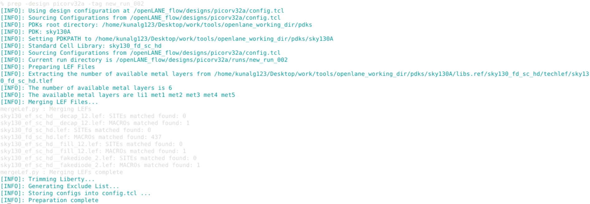

### RTL SYNTHESIS
OpenLANE uses YOSYS to convert the given verilog file to intermediary format used by ABC along with standard cell information to do standard cell mapping

```bash
run_synthesis
```
Synthesis run snapshot

Synthesis buff count snapshot

Synthesis Chip Area


## DAY 2 

Every step in openlance can be configured via a set of passed arguments to the commands


### FLOORPLANNING
During Floorplan the core area is divided into rows of fixed size. This size is essentially the hieght of standard cells. Larger standard cells are expanded horizontally but the increment has to be kept a integer number of standard widths.
Next any cells that need to be preplaced, for example a Macro, are placed onto this grid. This step is called pre placement.
After preplacement decoupling capacitors for the preplaced cells are inserted, along with
Endcaps as well as TAP cell insertion takes place. IO pin placement is also decided at this stage.

Standard Cells are not placed during the Floorplanning stage.

##### Utilization and Aspect Ratio
At floorplanning stage Utilization factor is the ratio of Area consumed by the logic mapped to standard cells by ABC to the Total Core Area
Aspect Ratio is Ratio of Chip Hieght to Chip Width. This basically describes the chip geometry in a rough manner.
There both can be adjusted in the floorplan.tcl file

##### IO Placement
IO placement is an important step which deals with the distribution of IO Pins around the die, There are different strategies that can be explored by changing the arguments provided in the README file for OpenLANE flow.

##### Endcap and TAP cell insertion
Endcap cells are cells inserted at the Horizontal boundry of the the core for a variety of reasons, one of them being avoiding damage to standard cells at the boundarys. 
Tap cells are inserted to body bias the substrate to prevent leakage.

Floorplan.tcl snapshot


### OpenLANE: Running floorplan
##### method 1
```bash
run_floorpan
```

Snapshots of running floorplan


### Viewing the Floorplan output in MAGIC
To view the floorplan in MAGIC we need to pass 3 files to it. We need the TECH file provided in the pdks, we need the merged LEF file generated post synthesis step
and the DEF file generated by the floorplan step.

```bash
magic -T ~/Desktop/work/tools/openlane_working_dir/pdks/sky130A/libs.tech/magic/sky130A.tech lef read ~/Desktop/work/tools/openlane_working_dir/openlane/designs/picorv32a/runs/new_run_006/tmp/merged.lef def read ~/Desktop/work/tools/openlane_working_dir/openlane/designs/picorv32a/runs/new_run_006/results/floorplan/picorv32a.floorplan.def
```

##### Selecting pins and using the what command
Zoom out and center on design -> press 'v' 
Selecting a pin -> hover cursor -> press 's'
Select an Area -> press LMB to select bottom left corner -> press RMB to select top right corner 
Zoom in to the selected area -> hold 'control' -> press 'z'


##### Inserted DECAP Cells


##### Inserted TAP CELLs 


##### Unplaced Standard CELLS


### Placement
Placement is the process or arranging the standard cells on the core using algorithms that optimise wirelength, congestion, etc.

##### OpenLANE: Placement
```bash
run_placement
```

Snapshot of the placed standard cells in MAGIC


Snapshot of empty bottom left corner


Zoomed in view of the placed standard cells


Zoomed in view of the placed standard cells near edge


##### Cell Design and Characterisation
A Standard Cell library contains many versions of a set of cells which do perform some boolean operation or provide storage.

Cell design flow basically takes as input the PDK, DRC, LVS, SPICE MODELS, LIBRARY AND USER DEFINED SPECS
Then the Circuit is designed, Layout is done and Characterisation takes place
The output of all these steps is a Circuit Description Language File.

GUNA is a tool which can be used to perform characterisation of Standard cells, IO pads, memories etc.

Timing characterisation includes extracting the cell output rise time, fall time, propagation delay, etc.

## DAY 3
### Cell design
pull the repository to obtain a inverter circuit layed out in magic and take a look at the files included
```git
git pull https://github.com/nickson-jose/vsdstdcelldesign
```
open the .mag file and take a look at the layed out inverter
you will need to provide the .TECH file an the .MAG file as arguments to the magic command.

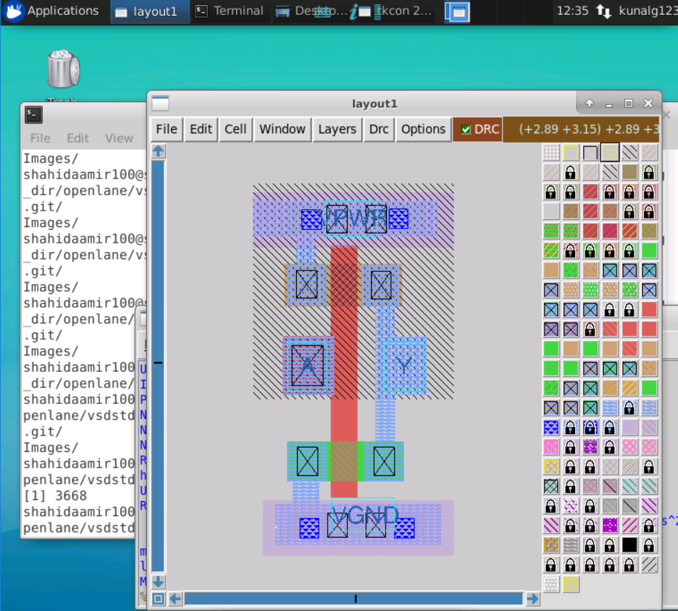
 
### DRC in MAGIC
DRC checks can be performed in magic using the following commands

```tk
drc count
drc why
drc find
```

drc count lists the count of DRC rules that have been violated, drc why explains the conflicting layer information and drc find lists the next error

### Extraction of SPICE netlist from the Layout
To simulate and extract the timing characteristics from the cell we need to extract the spice netlist so that we can simulate it in ngspice.

Extract the netlist
```tk
extract all
```
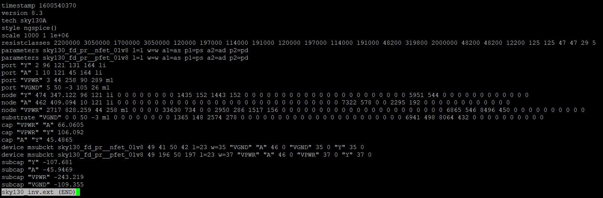

Convert it to a spice deck
```tk
ext2spice cthresh 0 rthresh 0
ext2spice
```
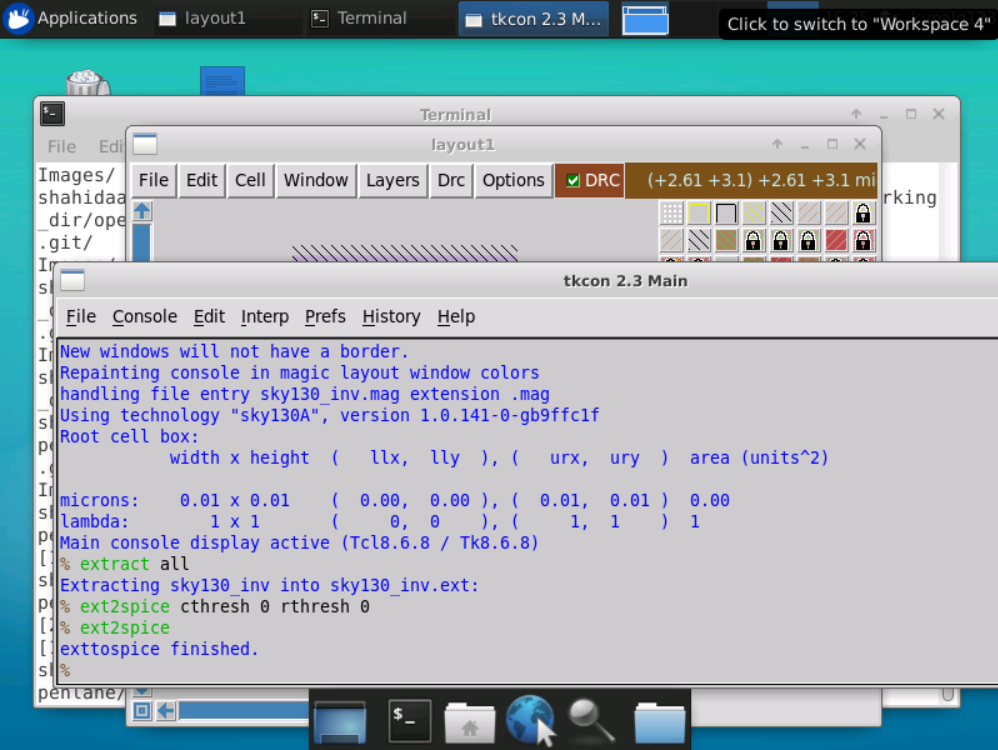
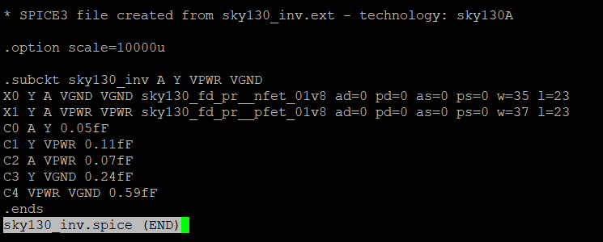

Edit the spice file to bias the Source and Drain.
Attach a pulsing power supply to the gate and add commands to run a transient analysis.
Also change the MOS names to something like M0,M1 as names starting with X have some special significance in ngSPICE and may throw Unknown SUB circuit error.
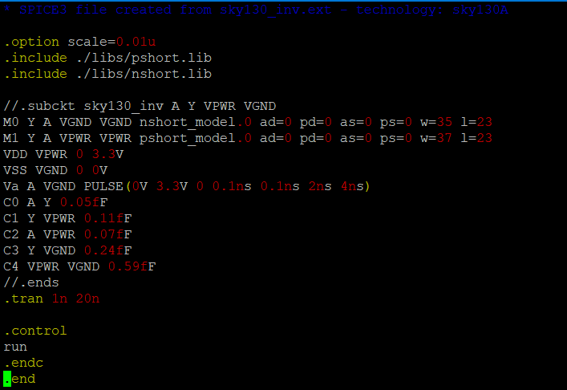

### Transient waveform Analysis
```tk
ngspice <name_of_SPICE_file>
plot Y vs time A
```

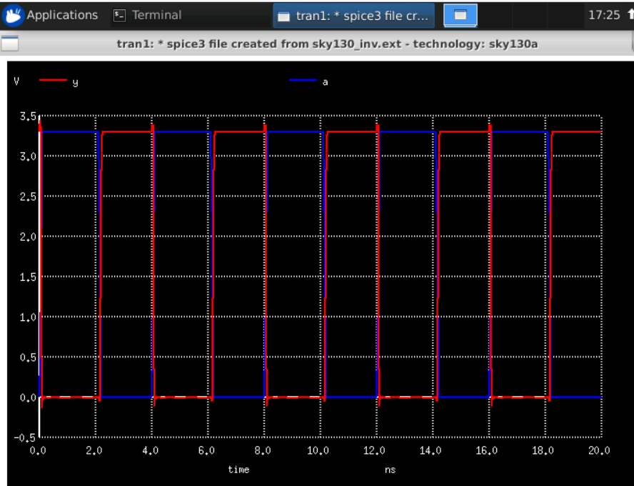


All percentages are w.r.t. full swing of the voltage output

| Timing Characteristic     	| Description                                                      	|
|---------------------------	|------------------------------------------------------------------	|
| Cell output rise delay    	| T.T. by output to rise to 50% after the input has fallen by 50%  	|
| Cell output fall delay    	| T.T. by output to fall to 50% after the output has fallen by 50% 	|
| Cell rise transition time 	| T.T. by output to rise to 80% from 20%                           	|
| Cell fall transition time 	| T.T. by output to fall to 20% from 80%                           	|


##### Cell output fall delay data points
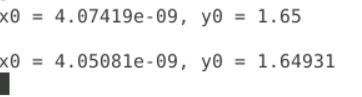
Cell output fall delay is 21.1 pico seconds


##### Cell output rise delay data points
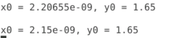
Cell output rise delay is 56.6 pico seconds


##### Cell Fall Transition Time data points
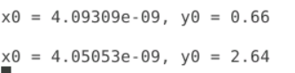
Cell Fall Transition time is 42.6 pico seconds


##### Cell Rise Transition Time  data points
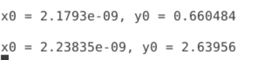
Cell Rise Transition time is 59.2 pico seconds

## DAY 4
### Checking the alignment of the custom Inverter cell
Open the sky130A tracks.info file
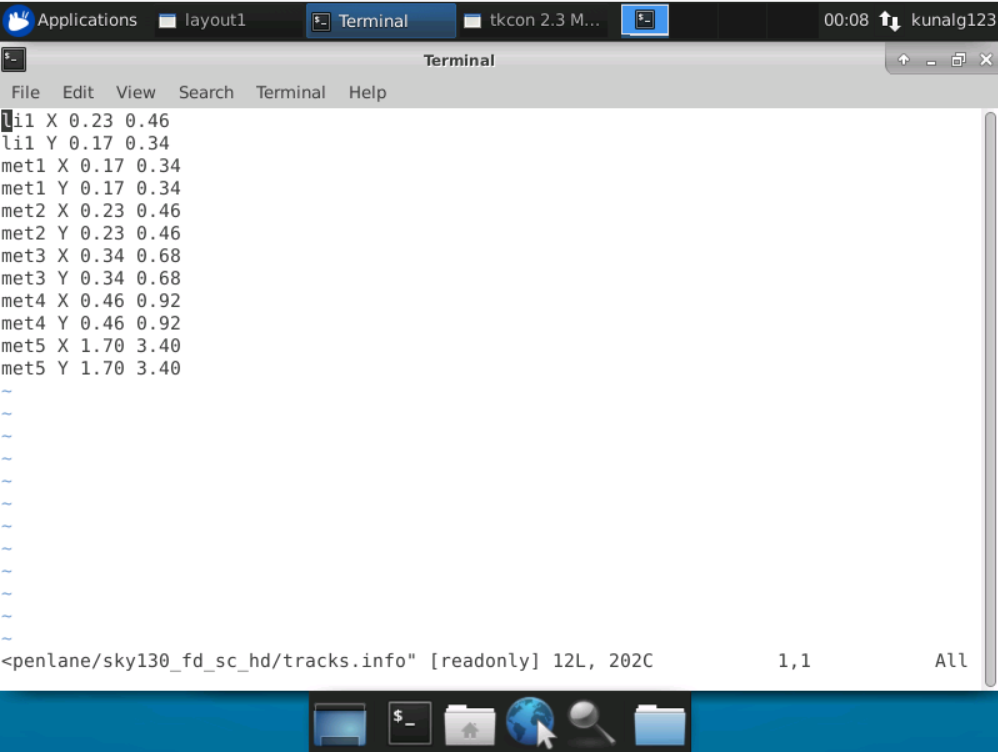

Note down the local interconnect xspacing, yspacing, xorigin and yorigin information
We will use this info to draw grid lines in magic and visually inspect the alignment of
the local interconnect tracks with the input and output ports.

Open the Inverter mag file in MAGIC and use the grid command to setup the local interconnect grid.
```tk
grid 0.46um 0.34um 0.23um 0.17um
```

Ensure that the grid x and y lines intersect at a point inside the A and Y port
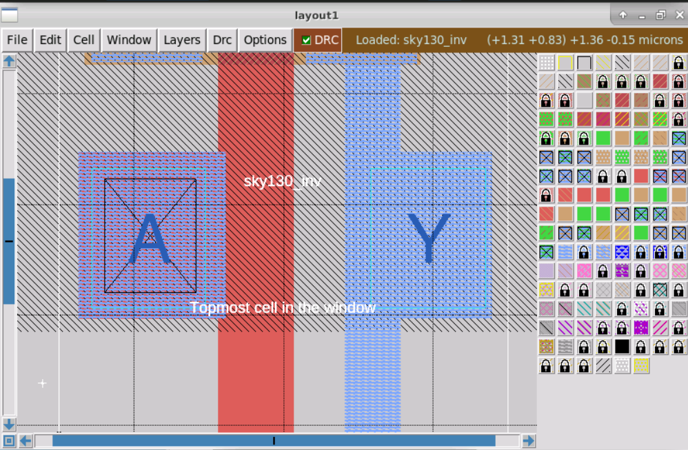

Ensure that width of the standard cell is an odd multiple of xpitch (0.46um)
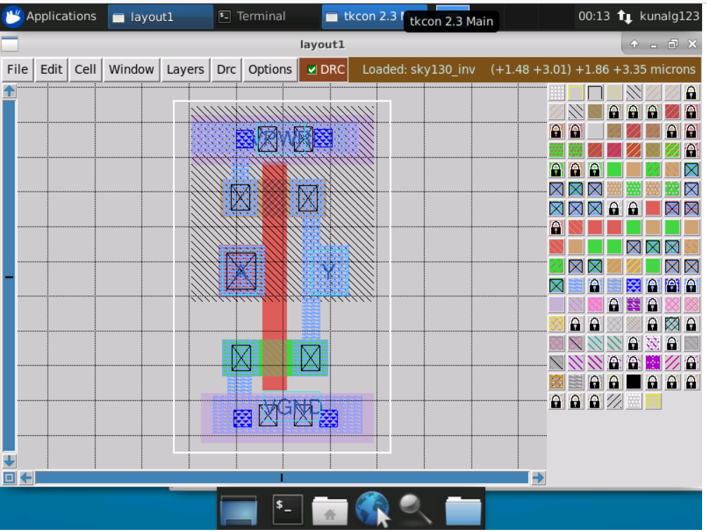

Ensure that A and Y have been declared as ports (already done for us).

### Extract the lef file from  mag file
```tk
lf write
```
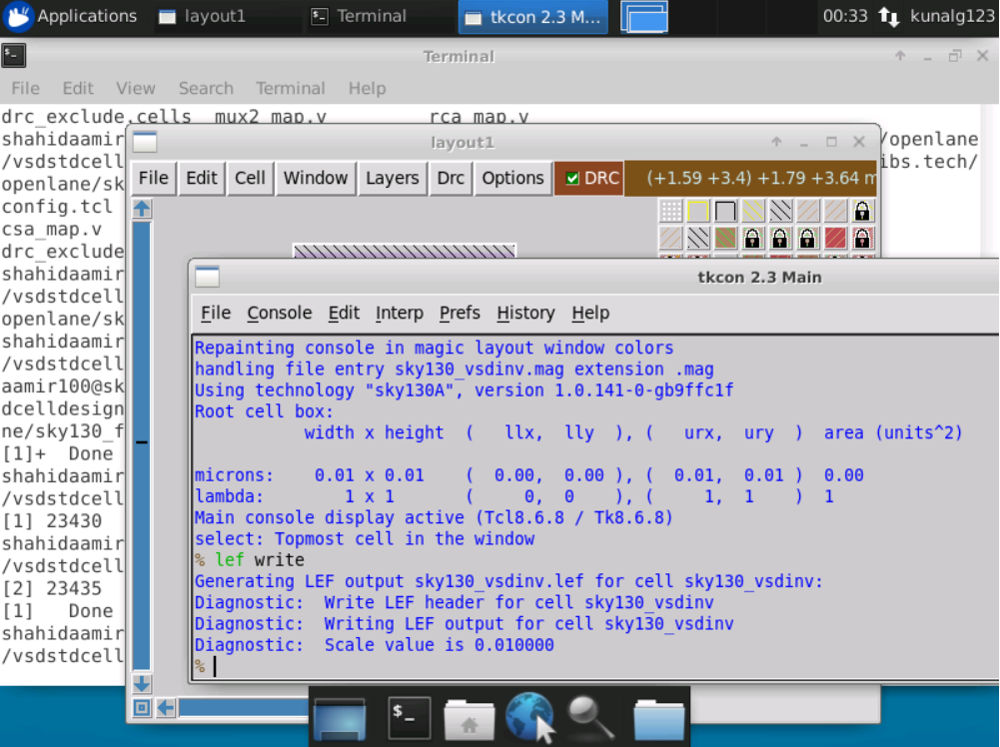

### Moving and setting up files
Copy the 
```
extracted lef file,  
vsdstdcelldesign/libs/sky130_fd_sc_hd__fast.lib
vsdstdcelldesign/libs/sky130_fd_sc_hd__slow.lib
vsdstdcelldesign/libs/sky130_fd_sc_hd__typical.lib
```
to openlane/designs/picorv32a/src/ directory

Copy the my_base.sdc from vsdstdcelldesign/extras/
to openlane/designs/picorv32a/src/ directory

Copy the sta.conf from vsdstdcelldesign/extras/
to openlane directory

Now sta can be performed from the openlane directory

### STA using OpenSTA

First synthesize the design using the run_synthesis command and ensure that the custom Inverter cell is being instantiated in the netlist

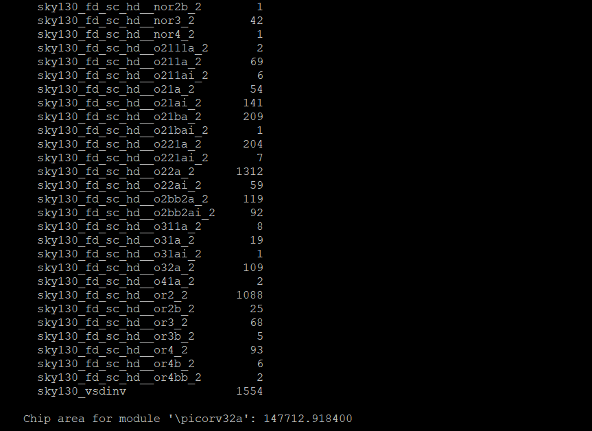
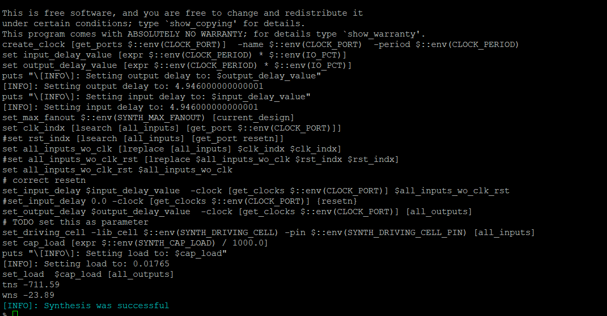

##### OpenSTA
OpenSTA can be launched from the OpenLANE environment using the sta command 
```bash
sta <conf_file>
```

sta command returns a Timing Analysis Report which contains Hold and Setup time slack as well as Total and Worst negative slack. 

Using this timing report we will list the conficting instances try to resolve negative slack.
One method is to replace conflicting instances with stronger buffered instances from the library to reduce the slack violations.

some usefull commands in this process
```tcl
report_checks
report_check -fields {net cap slew input_pins} -digits 4
replace_cell <instance> <library_cell_to_replace_with>
```
List the conflicting instances using the report_checks command and replace the cells using replace_cell command

Once the wns and tns is reduced to as small as possible we will proceed to CTS

### Clock Tree Synthesis

Clock tree synthesis is the process of generating a clock tree for a design after it has been passed through the synthesis, floorplan and placement stages.
```tcl
run_cts
```

## DAY 5

### Generating a Power Distribution Network
This step generates the Power distribution network which takes power from the power and ground pins of the die and distributes it to a Power ring which is in turn routed into a mesh with tracks and rails which form a 2d grid powering up the entire logic circuitary.

```tcl
gen_pdn
```

### Routing using TritonRoute

Global routing is done along with run_floorplan command using RePLAce tool
Detailed routing is done using Triton Route

TritonRoute honors the route guides placed by the fast route performed earlies using RePLAce.

```tcl
run_routing
```
